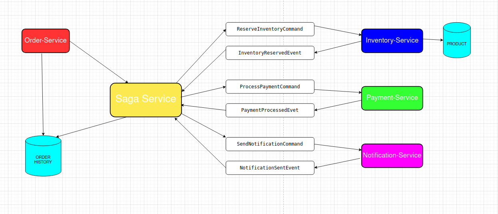

# Saga Pattern Microservices Project

This project demonstrates the implementation of the **Saga Pattern** using a set of microservices. The Saga Pattern is utilized to manage distributed transactions across multiple services, ensuring data consistency and fault tolerance. The key microservices in this project include **Order Service**, **Inventory Service**, **Payment Service**, and **Notification Service**.

---

## Architecture Overview



The architecture follows an event-driven design with Kafka as the central event broker. Each service is responsible for a specific business domain and communicates asynchronously through events. The **SagaService** coordinates the flow of events to maintain the consistency of distributed transactions.

### Components
1. **Order Service**
    - Handles order creation and completion.
    - Produces events such as `OrderCreatedEvent` and `OrderCompletedEvent`.

2. **Inventory Service**
    - Manages product inventory and reservations.
    - Produces events like `InventoryReservedEvent` and `InventoryReservationFailedEvent`.

3. **Payment Service**
    - Processes payments for orders.
    - Produces events such as `PaymentProcessedEvent` and `PaymentFailedEvent`.

4. **Notification Service**
    - Sends notifications to users regarding order status.
    - Produces events like `NotificationSentEvent` and `NotificationFailedSentEvent`.

---

## Workflow

### Event Flow
1. An **OrderCreatedEvent** is emitted when a new order is placed.
2. The **SagaService** listens for the event and issues a `ReserveInventoryCommand` to the Inventory Service.
3. On successful inventory reservation, the `InventoryReservedEvent` is emitted, and a `ProcessPaymentCommand` is sent to the Payment Service.
4. Upon payment success, the `PaymentProcessedEvent` triggers a `SendNotificationCommand` to the Notification Service.
5. Notifications are sent, and a `CompleteOrderCommand` is issued to complete the order.

### Failure Scenarios
- If inventory reservation fails, a `CancelOrderCommand` is triggered.
- If payment fails, a `CancelReserveInventoryCommand` is issued.
- If notification sending fails, a `CancelPaymentCommand` is sent.

---

## Commands and Events

### Commands
- **Order Service**
    - `CancelOrderCommand`
    - `CompleteOrderCommand`
- **Inventory Service**
    - `ReserveInventoryCommand`
    - `CancelReserveInventoryCommand`
- **Payment Service**
    - `ProcessPaymentCommand`
    - `CancelPaymentCommand`
- **Notification Service**
    - `SendNotificationCommand`

### Events
- **Order Service**
    - `OrderCreatedEvent`
- **Inventory Service**
    - `InventoryReservedEvent`
    - `InventoryReservationFailedEvent`
- **Payment Service**
    - `PaymentProcessedEvent`
    - `PaymentFailedEvent`
- **Notification Service**
    - `NotificationSentEvent`
    - `NotificationFailedSentEvent`

---

## Setup and Usage

### Prerequisites
- **Java 17+**
- **Spring Boot 3.0+**
- **Kafka**
- **Docker** (Optional for containerization)

### Running the Project
1. Clone the repository.
   ```bash
   git clone git@github.com:don1yal/Saga-Pattern.git
   cd Saga-Pattern
   ```
2. Start Kafka and Zookeeper.
   ```bash
   docker-compose up -d
   ```
3. Run each microservice.
   ```bash
   ./mvnw spring-boot:run -pl order-service
   ./mvnw spring-boot:run -pl inventory-service
   ./mvnw spring-boot:run -pl payment-service
   ./mvnw spring-boot:run -pl notification-service
   ```

---